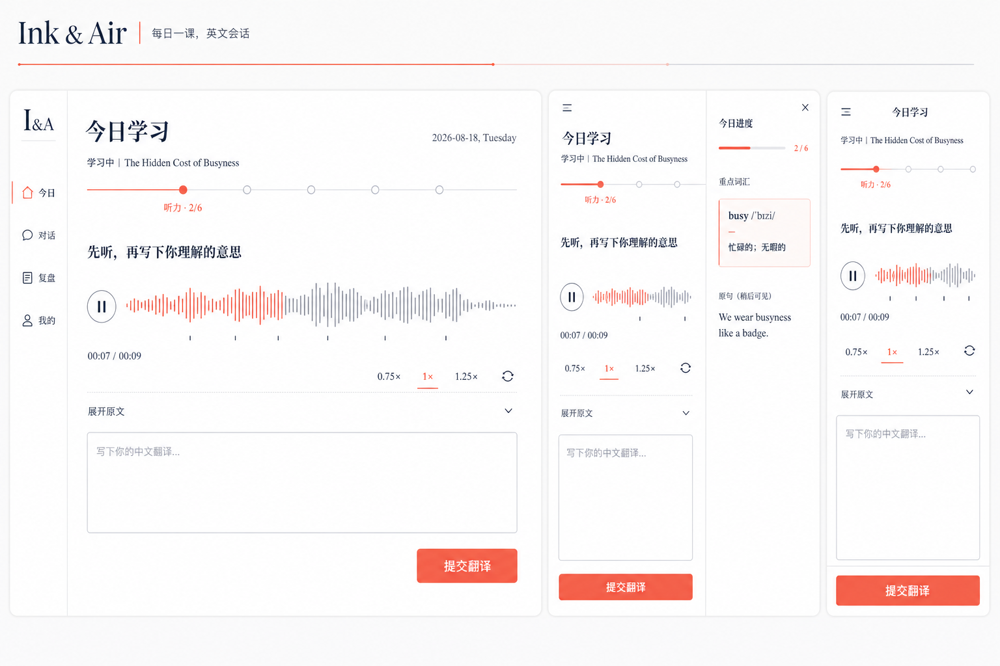
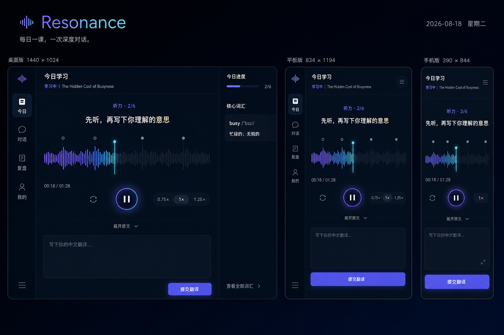
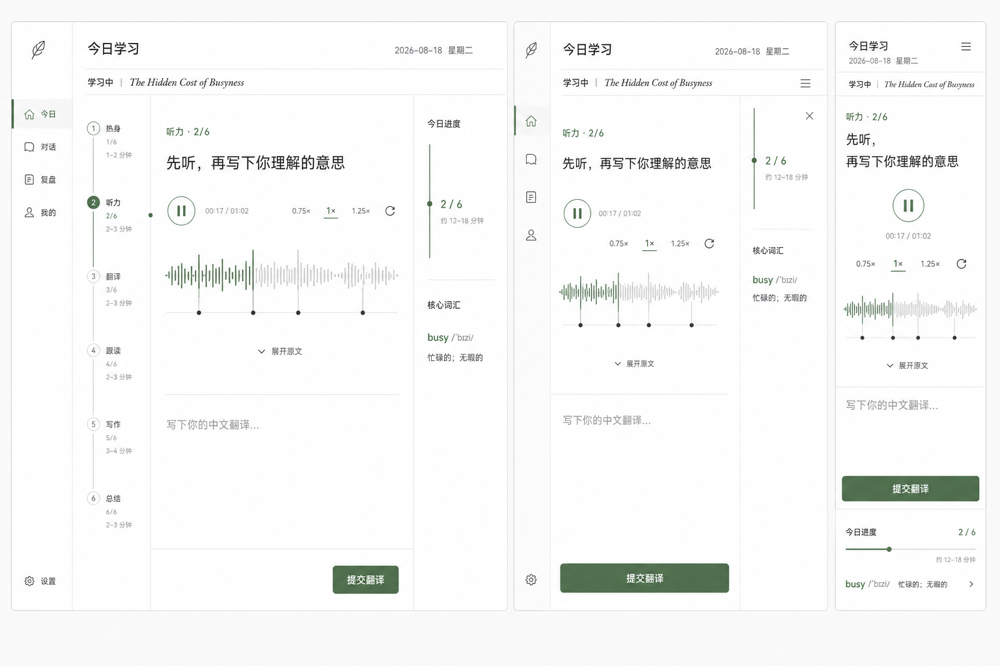
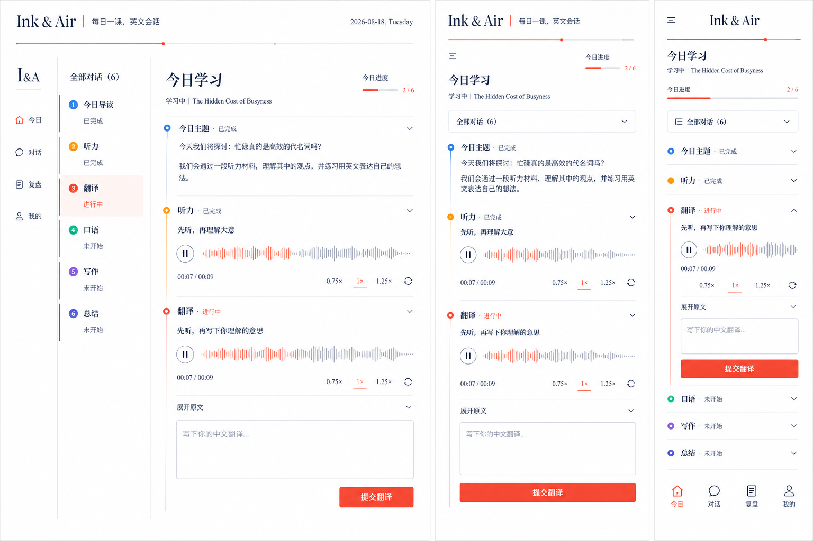
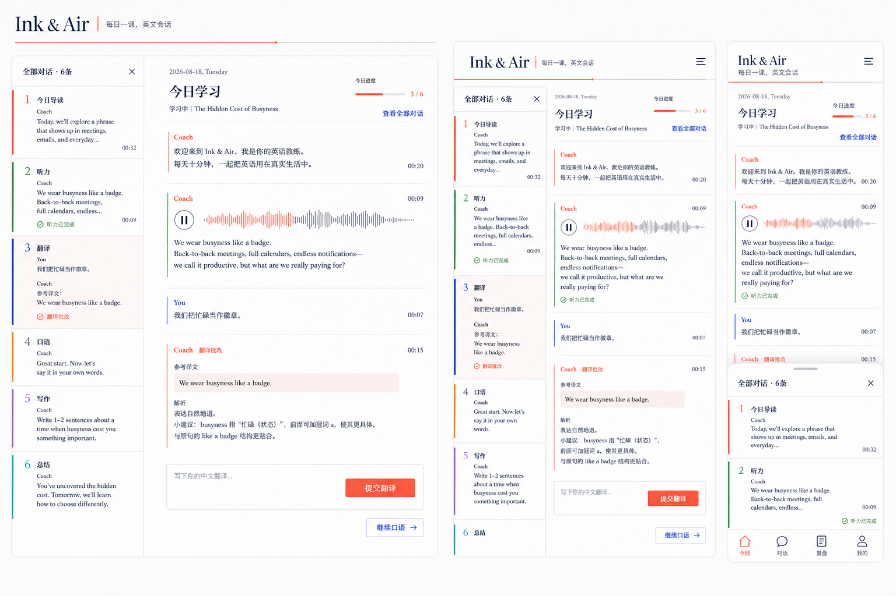
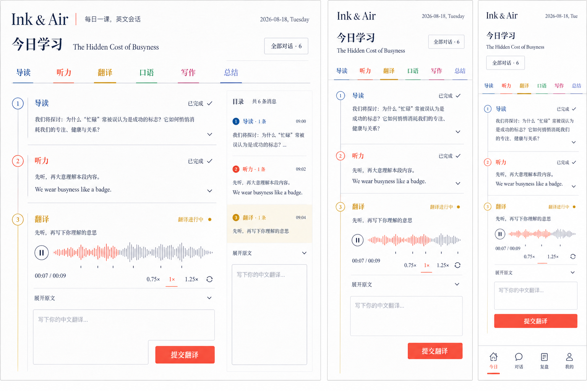
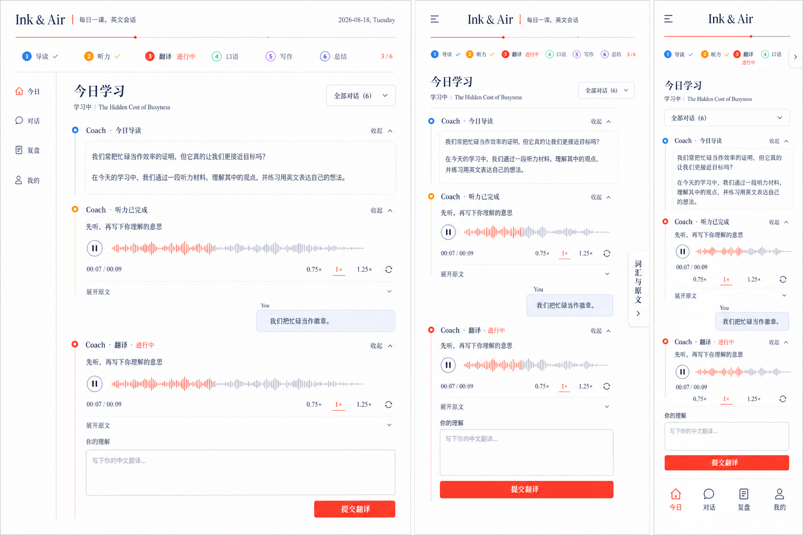
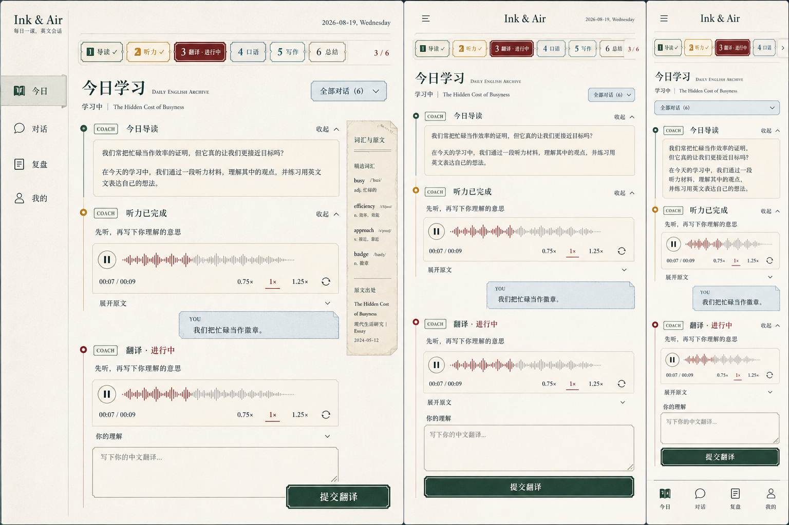

# AI English 每日英语 App：产品、内容与 UI 方案

> 文档版本：v0.2<br>
> 创建日期：2026-08-18<br>
> 当前阶段：UI 视觉方向探索<br>
> 文档用途：产品范围、内容体系、交互规范、实现计划与持续进度的唯一同步文档

## 1. 产品概述

### 1.1 产品定位

一款面向手机、平板和电脑端的每日英语学习 App。每天推送一篇约 100 多词的优质英语内容，通过一条连续的长对话完成听力、原文学习、翻译、口语、写作、错题复盘和当日总结。

产品不把学习过程拆成大量相互割裂的页面，而是让用户像与一位长期英语教练对话一样持续推进。每篇文章对应一条独立对话，完成后以“综合成绩 + 主题”命名，例如：

```text
8.4分｜Why We Procrastinate
7.8分｜The Hidden Cost of Busyness
9.1分｜How Small Talk Builds Trust
```

### 1.2 核心价值

- 每天一篇，降低开始学习的心理成本。
- 一篇内容同时训练输入、输出和复习，形成完整闭环。
- 所有错误都进入可追踪、可再次作答的错题系统。
- 用真实优质内容维持长期兴趣，而不是只使用教材式例句。
- 根据四六级、雅思、托福或日常交流目标调整难度和评分解释。

### 1.3 目标用户

- 希望保持每日英语输入的大学生和职场人。
- 正在准备四级、六级、雅思或托福的学习者。
- 阅读能力尚可，但听说写输出不足的用户。
- 不喜欢机械背词，希望通过真实话题学习的人。

### 1.4 单日学习目标

- 建议总时长：12–18 分钟。
- 核心文章长度：120–180 词；特殊内容可按 100–220 词弹性处理。
- 写作训练：3–5 句。
- 口语训练：关键句跟读 + 20–40 秒主题表达。
- 当日复盘：3–8 个由错误自动生成的任务。

## 2. 内容体系

### 2.1 内容来源

内容库支持直接采集、复制、人工录入和长文拆分。优先选择近十年内仍具学习和讨论价值的材料，包括：

- BBC、TED、公开演讲和访谈。
- 国际、科技、商业与社会新闻。
- 英语真实生活场景和美式口语素材。
- 精选外刊文章。
- 职场沟通、心理成长、教育和社会话题。
- 文化、旅行、健康、科学和人物故事。
- 用户或编辑推荐的其他优质英文内容。

系统保存原始全文，学习端根据难度和语义结构展示精选片段。对外展示来源名称、原文标题、作者、发布日期、原文链接和采集日期。

> 运营说明：技术上支持直接采集和复制；若产品公开商业发布，仍需建立来源授权、投诉处理和快速下架机制，避免内容库因来源规则变化而无法持续运营。

### 2.1.1 数据边界

项目现有的“中英文全场景常用短句”工作簿不属于本 App 的内容体系，保持独立且不参与任何导入或生成流程：

- 不导入文章库、句子库、词汇库或练习库。
- 不作为听力、翻译、口语、写作和复盘题源。
- 不用于生成首批种子数据、演示数据或模型提示词。
- 不与后续采集的文章内容混合、去重或建立关联。

App 内的句子、重点词汇、翻译题、口语题和写作题全部从对应的当日文章或长文分段中提取，确保每个学习环节围绕同一篇内容形成闭环。

### 2.2 长文章拆分规则

长篇内容不按固定字数粗暴截断，而按完整语义单元拆成连续系列：

```text
原始长文
  ├─ Part 1：背景与问题
  ├─ Part 2：观点或案例
  ├─ Part 3：原因与推论
  └─ Part 4：结论与延伸
```

每个分段需要：

- 保持完整句子和自然段，不在从句中间截断。
- 目标长度 120–220 词。
- 补充不剧透后文的最小背景说明。
- 标注系列名称、当前序号和总分段数。
- 允许用户继续下一段或等待次日推送。
- 前后分段共享来源、人物、主题和核心词汇上下文。

### 2.3 内容质量评分

候选内容经过机器筛选和编辑审核，满分 100 分，低于 80 分不发布：

| 维度 | 权重 | 判断标准 |
| --- | ---: | --- |
| 来源与可信度 | 20 | 来源清晰、正文完整、无明显拼接或营销污染 |
| 语言真实性 | 20 | 表达自然、句法真实、适合现代英语学习 |
| 学习价值 | 20 | 有可训练词汇、句型、语音或表达点 |
| 话题价值 | 15 | 有趣、有启发、能引发口语或写作表达 |
| 信息准确性 | 15 | 人名、数字、事实和上下文可核验 |
| 时效与耐久度 | 10 | 新闻不过度陈旧，常青内容具长期价值 |

额外质量规则：

- 去除广告、导航、相关推荐和网页噪声。
- 使用正文指纹和语义相似度双重去重。
- 标记敏感、争议、医疗、政治和未成年人内容，进入人工审核。
- 检查文本是否存在断句、乱码、引号缺失和事实不完整。
- 音频生成前再次检查数字、专有名词和缩写的读法。
- 内容发布后接受用户报告，并支持版本修订和一键下架。

### 2.4 内容难度

| 等级 | 参考目标 | 文章特点 |
| --- | --- | --- |
| L1 基础 | 高中 / 四级 | 高频词为主，短句较多，背景直观 |
| L2 进阶 | 六级 / 雅思 5.5–6.5 | 适量复合句、抽象表达和真实语速 |
| L3 高阶 | 雅思 7+ / 托福 | 更密集的信息、观点论证和学术词汇 |

难度不是只按生词率判断，还综合句长、从句层级、信息密度、抽象程度、语速和主题背景知识。

### 2.5 内容采集流水线

```text
来源白名单 / RSS / URL / 人工录入
                ↓
          正文抓取与清洗
                ↓
      去重、语言识别、完整性检测
                ↓
       来源元数据与原文全文入库
                ↓
        质量评分与风险分类
                ↓
       长文语义拆分 / 短文保留
                ↓
  难度、词汇、写作题、口语题生成
                ↓
       美式音频与句子时间轴生成
                ↓
             编辑审核
                ↓
          排期与每日推送
```

## 3. 产品信息架构

### 3.1 一级导航

| 导航 | 作用 |
| --- | --- |
| 今日 | 开始或继续当天的学习对话 |
| 对话 | 查看历史文章、成绩和未完成内容 |
| 复盘 | 当日复盘、每周复盘、错题本、生词本 |
| 我的 | 学习目标、难度、提醒、声音、账户和隐私设置 |

电脑端使用左侧固定导航；平板使用可收起侧栏；手机使用底部导航。

### 3.2 核心页面

1. 启动与目标设置。
2. 今日首页。
3. 每日长对话学习页。
4. 单词释义浮层或侧边栏。
5. 翻译评分与逐句批改。
6. 口语录音、回听与评分。
7. 写作两次作答。
8. 当日错题复盘。
9. 每周复盘。
10. 当日总结。
11. 历史对话。
12. 错题本与生词本。
13. 设置与学习报告。

## 4. 每日长对话学习流程

### 4.1 对话状态

```text
READY
  → LISTENING
  → TRANSLATION_DRAFT
  → TRANSLATION_GRADED
  → SPEAKING_RECORDING
  → SPEAKING_GRADED / SPEAKING_RETRY_REQUIRED
  → WRITING_ACTIVE
  → DAILY_REVIEW
  → COMPLETED
```

每次提交都保留版本。已评分答案不能直接覆盖，但用户可以创建新版本重新提交，方便比较进步。

学习步骤控制“下一步是否可提交”，不隐藏已经产生的对话内容。用户在“今日学习”中可以随时打开“全部对话”，查看、展开并跳转至当日已有的导读、听力、翻译、批改、口语、写作和总结消息；未开始的环节只展示进度状态，不提前展示答案。

所有位于当前进度之前的对话默认完整展开，按时间顺序组成类似聊天软件的连续消息流，包括教练消息、音频、用户回答和批改结果。完成环节右上角提供安静的“收起”操作，但系统不自动折叠；用户主动收起后可随时重新展开。

### 4.2 听力

默认隐藏英文原文，展示：

- 美式音频、波形和进度。
- 0.75×、1×、1.25×语速。
- 播放、暂停、前后 5 秒、单句循环和全文循环。
- 用户可编辑的中文理解区。
- “展开原文”操作。

音频按句生成时间轴，展开原文后可点击句子从对应位置播放。默认使用稳定、自然、无明显地域色彩的美式发音。

### 4.3 原文、查词与翻译

展开原文后，用户可点击任意词查看：

- 美式音标和发音。
- 词性与当前语境释义。
- 原形、常见变形和简短例句。
- 是否为本课重点词。
- 加入生词本。

提交翻译后，系统连续回复：

1. 总分、分项分、逐句差异和解释。
2. 完整参考译文。

翻译评分：

| 维度 | 权重 |
| --- | ---: |
| 信息准确度 | 40% |
| 完整度 | 20% |
| 语法和逻辑关系 | 15% |
| 词义与语境 | 15% |
| 中文表达自然度 | 10% |

评分按照用户选择的四级、六级、雅思或托福目标调整严格度和解释重点，不把不同考试官方分数机械换算成同一分数。

### 4.4 口语

口语环节包含：

- 必做：朗读或跟读关键段落。
- 进阶：围绕当天话题自由表达 20–40 秒。

录音交互支持点击开始、点击结束、取消、发送前回听、重新录制和查看历史版本。评分维度：

| 维度 | 权重 |
| --- | ---: |
| 发音准确度 | 30% |
| 流利度和停顿 | 25% |
| 重音与语调 | 15% |
| 语法准确度 | 15% |
| 词汇与表达 | 15% |

低于 6 分必须重录。反馈需要定位到单词或时间段，并解释错误、给出改法和可播放的示范音频。

### 4.5 写作

从当日文章提取 3–5 条短句或复合句，先给中文，用户输入英文。每题有两次机会：

- 第一次错误：指出错误类型并给轻提示，不公布答案。
- 第二次错误：给出正确英文、可接受表达和原因。

判定允许语义一致的不同正确表达，重点检查单词、拼写、时态、单复数、冠词、主谓一致、语序和固定搭配。

### 4.6 错题复盘

自动记录：

- 翻译中的漏译、误译和逻辑关系错误。
- 写作中的词汇、拼写、时态、单复数和语法错误。
- 口语中的发音、重音、停顿和表达错误。

当日结束前立即重做关键错误；每周根据掌握度重新生成翻译、写作和录音任务。后续采用 1、3、7、14、30 天间隔复习。

### 4.7 当日总结

综合分构成：翻译 40%、口语 35%、写作 25%。复盘完成度单独显示，不通过重复答题抬高成绩。

总结包含：

- 综合分和分项分。
- 学习时长、听力次数和重录次数。
- 今日掌握词汇与句型。
- 高频错误和改进建议。
- 当日最佳表现。
- 明日训练重点。

完成后更新对话标题为“成绩 + 主题”。

## 5. 多端 UI 与响应式策略

### 5.1 手机端：390 × 844 基准

- 单栏长对话，输入区固定在底部。
- 顶部保留标题、横向六步进度、当前步数和“全部对话”入口。
- 学习进度只在顶部横向展示，不使用左侧垂直进度栏。
- 音频播放器可折叠为迷你播放器。
- 词义使用底部抽屉，不遮挡当前句子。
- 录音按钮在录制时变为波形和停止动作。
- 底部固定一级导航“今日、对话、复盘、我的”，学习对话中同样保留。
- 翻译输入、录音操作和提交按钮始终位于底部导航及安全区域上方，不发生遮挡。

### 5.2 平板端：834 × 1194 基准

- 左侧为可收起的课程和历史对话列表。
- 主区域保持舒适的阅读行宽。
- 单词、评分详情使用右侧临时面板。
- 横屏时可形成“对话 + 学习详情”双栏。

### 5.3 电脑端：1440 × 1024 基准

- 左栏：仅保留一级产品导航，不放置学习进度。
- 顶部：横向展示导读、听力、翻译、口语、写作、总结六步进度，可点击定位对应消息。
- 中栏：当天连续长对话与固定输入区，当前进度之前的消息默认展开。
- 右栏：只展示词汇详情、评分维度或文章来源，不重复学习进度。
- 中栏正文最大阅读宽度约 720 px，避免大屏文本过长。
- 三栏均可独立滚动，但播放状态和学习进度保持同步。

### 5.4 断点建议

```text
0–639px      手机单栏
640–1023px   平板单栏 / 双栏
1024–1279px  紧凑桌面双栏
1280px+      完整桌面三栏
```

## 6. 视觉设计方向

本轮使用 Product Design 插件进行三套独立视觉探索，三套方案都必须遵守：

- 阅读优先，正文行宽舒适。
- 英文内容和中文反馈具有清晰但不割裂的层级。
- 不滥用卡片、阴影、渐变和玻璃效果。
- 控件有清晰的悬停、按下、选中、禁用和加载状态。
- 手机、平板和电脑共享同一设计语言。
- 图标使用一致的专业图标库，不使用 Emoji 作为正式功能图标。

候选方向：

1. 编辑部杂志感：纸张白、深墨蓝、克制珊瑚色，英文衬线与中文无衬线配合。
2. 沉浸式声波感：深海军蓝、冷紫与青色声波，突出音频和口语反馈。
3. 极简学习工作台：纯净白、石墨黑和鼠尾草绿，强调秩序、专注与长期使用。

### 6.1 第一轮跨端原型图

以下三张图分别展示同一核心学习场景在电脑、平板和手机端的响应式适配。当前仅用于确定视觉方向，选定后再补齐翻译批改、口语录音、写作、复盘和总结等关键状态。

**方向 1**



**方向 2**



**方向 3**



### 6.2 原型 1 的第二轮视觉变体

本轮保持原型 1 的编辑部杂志感，增加更丰富的章节色彩，并统一加入以下交互：

- 今日学习可随时查看并跳转到全部已有对话内容。
- 电脑端使用章节轨迹、对话抽屉或目录面板呈现历史内容。
- 平板端使用可折叠目录或侧滑抽屉。
- 手机端固定底部导航“今日、对话、复盘、我的”。
- 手机端“全部对话”使用顶部入口、章节条或底部抽屉，不遮挡输入与提交。

**第二轮方向 1**



**第二轮方向 2**



**第二轮方向 3**



### 6.3 选定方向 1：顶部进度与默认展开聊天流

用户选定第二轮方向 1，并确认以下最终结构：

- 删除左侧垂直学习进度栏。
- 六步进度固定在今日学习顶部，可点击定位消息。
- 左侧仅保留产品一级导航。
- 当前进度之前的教练消息、音频、用户回答和反馈默认展开。
- 已完成环节由用户主动收起，系统不自动折叠。
- 手机端继续使用固定底部一级导航。



### 6.4 参考图衍生：档案馆编辑风格

在选定方向 1 的信息结构和交互规则不变的前提下，进一步采用“阅读档案馆 / 经典出版物”的视觉语言：

- 使用暖象牙纸色、雾蓝灰、深森林绿、酒红、旧金与粉蓝构成低饱和但层次丰富的配色。
- 六步进度改为顶部横向票据标签，完成、进行中和未开始状态通过颜色、描边和小型状态文字区分。
- 教练消息、音频、用户回答和批改反馈继续组成默认展开的连续聊天流，不改回卡片式步骤列表。
- 词汇、来源与评分信息使用档案标签、页签和批注纸张意象；正式控件统一采用细线框、双线主按钮和轻微纸张质感。
- 桌面端左侧仍只放产品一级导航；平板收窄辅助栏；手机端保留固定底部导航。
- 参考图仅用于视觉语言提炼，不复制其中的品牌、文案、浏览器界面或水印。



## 7. 动效与交互规范

### 7.1 动效原则

- 动效用于解释状态变化，不做无意义装饰。
- 普通反馈 160–220 ms；面板切换 220–320 ms。
- 尊重系统“减少动态效果”设置。
- 切换学习环节时保留上下文，不让页面突然跳顶。

### 7.2 关键动效

- 新消息轻微上移并淡入。
- 播放时波形与当前句同步高亮。
- 展开原文时按句渐进显示，不整屏闪现。
- 录音按钮平滑变形为停止按钮，外围显示实时音量。
- 评分数字短暂递增，随后展开各维度解释。
- 逐句批改使用局部颜色和下划线过渡定位错误。
- 正确写作答案使用克制的确认动画；错误时只轻微震动输入区。
- 当日完成后进度圆环闭合，对话标题平滑更新。

## 8. 无障碍与可用性

- 正文和主要控件达到 WCAG AA 对比度。
- 所有音频操作支持键盘和屏幕阅读器。
- 不仅依靠红绿颜色表达对错，同时使用文字和图标。
- 手机触控目标不小于 44 × 44 px。
- 支持字号放大、字幕和减少动态效果。
- 录音前明确提示权限用途，失败时提供可恢复操作。
- 用户录音提供删除入口和保存周期说明。

## 9. 技术实现建议

### 9.1 前端

- React + TypeScript 构建响应式 Web/PWA，优先覆盖手机、平板和桌面。
- 需要进入应用商店时使用 Capacitor 打包，或在第二阶段迁移 React Native 外壳。
- 组件层共享设计令牌、状态逻辑、评分展示和学习流程。
- 音频使用句子级时间轴，录音采用统一媒体适配层。
- 离线缓存当日文章、音频、草稿和未提交录音。

### 9.2 后端与 AI

- PostgreSQL 保存内容、学习状态、评分、错题和复习计划。
- 对象存储保存文章音频和用户录音。
- 内容采集服务采用来源适配器，支持 RSS、HTML、URL 和人工录入。
- 翻译与写作评分使用结构化评分规则和固定 JSON 输出。
- 口语使用语音识别、时间戳、发音分析和综合评分。
- 评分保存模型版本、规则版本、输入证据和分项结果，保证可追踪。

### 9.3 核心数据对象

- `users`：账户与偏好。
- `learning_profiles`：目标考试、等级、兴趣和提醒。
- `content_sources`：来源规则和采集状态。
- `source_articles`：原始全文与来源元数据。
- `lesson_segments`：拆分后的每日学习片段。
- `lesson_sentences`：句子、时间轴和重点词汇。
- `conversations`：每日长对话及完成状态。
- `submissions`：翻译、写作和口语提交版本。
- `grading_results`：总分、分项分和反馈证据。
- `error_items`：标准化错题。
- `review_tasks`：当日和间隔复习任务。
- `daily_summaries`：当日总结。

## 10. 版本计划

### Phase 0：方案与视觉原型

- 完成产品与内容方案。
- 生成三套跨端 UI 方向。
- 选定视觉方向并生成关键状态图。
- 固化颜色、字体、间距、组件和动效规则。

### Phase 1：可交互前端原型

- 响应式应用外壳。
- 今日长对话。
- 音频播放器、原文展开和查词。
- 翻译提交与模拟批改。
- 录音、回听与模拟评分。
- 写作两次机会。
- 当日总结和历史对话。

### Phase 2：后端与真实能力

- 登录、同步和内容数据库。
- 内容抓取、清洗、拆分和审核后台。
- 真实 TTS、语音识别和口语评分。
- 真实翻译、写作批改和参考答案生成。
- 错题本、每周复盘和推送。

### Phase 3：质量与发布

- 多端兼容、性能、离线和弱网测试。
- 评分一致性与内容质量抽检。
- 无障碍、隐私和录音数据检查。
- 灰度发布、数据监控和内容运营流程。

## 11. MVP 验收标准

- 手机、平板和电脑端无横向溢出，核心任务均可完成。
- 当天所有学习环节在同一对话上下文内连续推进。
- 音频支持倍速、重复、进度与句子定位。
- 翻译批改包含分数、逐句错误、原因和参考译文。
- 口语支持录制、取消、回听、提交、评分和低于 6 分重录。
- 写作严格执行两次机会，并接受合理的同义正确表达。
- 翻译、写作和口语错误进入错题本并参与当日复盘。
- 完成后生成总结并将对话改名为“成绩 + 主题”。
- 内容支持完整来源记录、长文语义拆分、去重和质量评分。
- 刷新或跨端登录后可恢复学习进度和草稿。

## 12. 进度记录

### 2026-08-19

- [x] 用户确认按照本方案进入 MVP 开发。
- [x] 完成 React、TypeScript、Vite 和 Node.js 工程搭建。
- [x] 完成档案馆编辑风格的响应式登录页与应用外壳。
- [x] 完成今日学习、对话档案、复盘和个人档案四个主要界面。
- [x] 将六步学习进度放置在“今日学习”下方。
- [x] 完成导读、听力、翻译、口语、写作和总结的可交互 MVP 流程。
- [x] 完成本地账号登录、退出和会话 Cookie。
- [x] 完成跳过当前文章并切换下一篇内容。
- [x] 完成内容结构、质量、去重和来源检查流水线，首批 5 篇内容全部通过。
- [x] 完成 Windows 一键启动、一键关闭、PID、日志和健康检查。
- [x] 服务已支持同一 Wi-Fi 下的手机访问。
- [x] 一键启动脚本可自动显示当前手机访问地址。
- [x] 完成生产构建、本机健康检查和局域网 HTTP 检查。
- [x] 增加健康检查、登录、Cookie 会话和退出登录 API 集成测试。
- [x] 新增 `docs/AI_ENGLISH_MVP_DELIVERY_STATUS.md`，记录当前交付、问题和计划。
- [x] 审查敏感文件与忽略规则，形成首个完整 MVP Git 基线。
- [ ] 在真实手机上完成登录、六步学习、跳过、录音和响应式人工验收。
- [ ] 将内容库从 5 篇扩充到 1000 篇。
- [ ] 接入真实 TTS、语音识别、口语评分、翻译和写作批改。
- [ ] 建立数据库与电脑、手机跨设备进度同步。

### 2026-08-18

- [x] 汇总第一版产品需求。
- [x] 将内容策略调整为支持直接采集、复制和长文连续拆分。
- [x] 明确排除项目现有场景短句库，后续仅使用文章来源内容。
- [x] 确定手机、平板和电脑三端适配策略。
- [x] 选定 Product Design 作为 UI 设计插件。
- [x] 生成三套高保真跨端 UI 视觉方向。
- [x] 按原型 1 生成三套更丰富色彩的跨端视觉变体。
- [x] 在新原型中加入全部对话回看和手机底部导航。
- [x] 用户选择第二轮方向 1。
- [x] 将学习进度移至顶部并取消左侧进度栏。
- [x] 将历史学习内容调整为默认展开的连续聊天流。
- [x] 基于参考图完成档案馆编辑风格的跨端修订版。
- [x] 用户确认以档案馆编辑风格最终修订版作为开发基线。
- [x] 输出关键页面与状态原型。
- [x] 开始响应式可交互实现。

本轮产物：

- `design/prototypes/direction-1-ink-and-air.png`
- `design/prototypes/direction-2-resonance.png`
- `design/prototypes/direction-3-quiet-studio.png`
- `design/prototypes/selected-direction-1-archive-editorial-style.png`

## 13. 待决策项

- 产品正式名称与中英文品牌名。
- 默认浅色还是跟随系统主题。
- 新闻类内容是否允许连续多日组成专题。
- 自由口语是每日必做还是进阶可选。
- 第一版采用 PWA 快速上线，还是同时打包原生应用。

---

后续每次设计、实现、测试和修订都更新“进度记录”，并在相关章节同步最终决策，避免方案文档与实际产品脱节。
